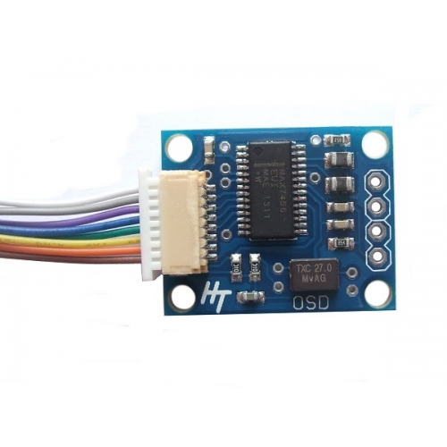

### MAX7456 Custom image encoder

This is a rather simple code to translate a .tif image into one that can be displayed by the MAX7456 programmable OSD.


It consists of a Python code that translates the image into line codes that then need to be copied into the given Arduino sketch to control the OSD.

## Image preparation

You will need an image which dimensions are a multiple of 18x12 pixels, in .tif format (I tested up to six tiles).
In the example above, *'image_example.tif'* is composed of two lines of three 18x12 tiles side by side. Be sure to use three separate colors. I like using black, white and grey, which will display as follows on the OSD :
* white = transparent
* grey = white
* black = black

To make such an image, you can use a very simple software such as Paint. fix the canvas size, and draw whatever you like.

Once the image is created, be sure to save it as '.tif' format in the same folder as the python code, and change the code line :
```
image=io.imread('image_example.tif')
```
with the name of the file you just created.

## Setting up the Pyhon program

Once your image is ready to be coded, open the python program in your IDE, and change the following values :
```
grey_threshold=85
white_threshold=210
```
depending on the intensity of the colors you chose.

Be sure to have a text file named 'final_code.txt' in the same folder as the python code, and that it can be overwritten.
If you wish to use a different file name, change it in the python code as well :
```
file = open("final_code.txt","w")
```
Then run the Python code once.

## Uploading it to the Arduino

After running the Python code, if the program didn't return any error, when you open the text file, you should see code lines appeared.
Copy the whole text of the file, then paste it in the Arduino sketch:

```
void osd_create_char()
{
  // paste the custom character code generated here
  // be careful with the addresses so not to overwrite exisiting characters
}
```

The first time you upload the code to the arduino board, uncomment the line :
```
//osd_create_char()
```
The following uploads, you can comment it back, since the image will be stored in the eeprom memory.

## To display the character

In the arduino sketch, use the command:
```
osd_print_byte(line, column, byte)
```
With the line and column placement of the tiles you want to use, and byte in the format 0xC1 to 0xC6 (they are the corresponding eeprom addresses of each of the tiles you put on your image).

## Errors

Here are the errors you might encounter when running the Python code:
* "height error" : Check that your image's height is a multiple of 18 pixels,
* "width error" : Check that your image's width is a multiple of 12 pixels,
* "image too big" : Check that your image is smaller or equal in size to 6 tiles (You can modify the code in order to save more tiles if necessary).

## Please read !

I am sharing this code as is, I have tried it myself, and it seems to be working, but I am not responsible for any misuse of the Max7456 OSD breakboard.
Please read about how to use the OSD and try to understand the code before testing it on the device.

Have fun !